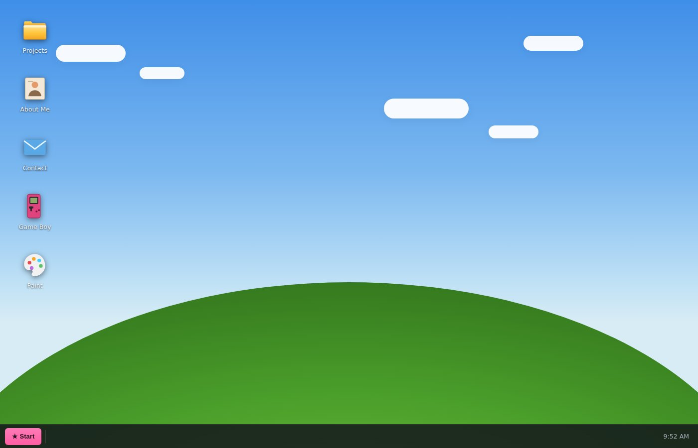
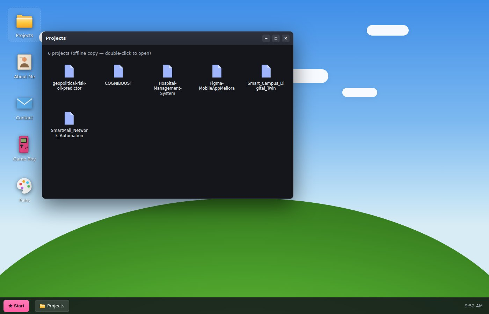
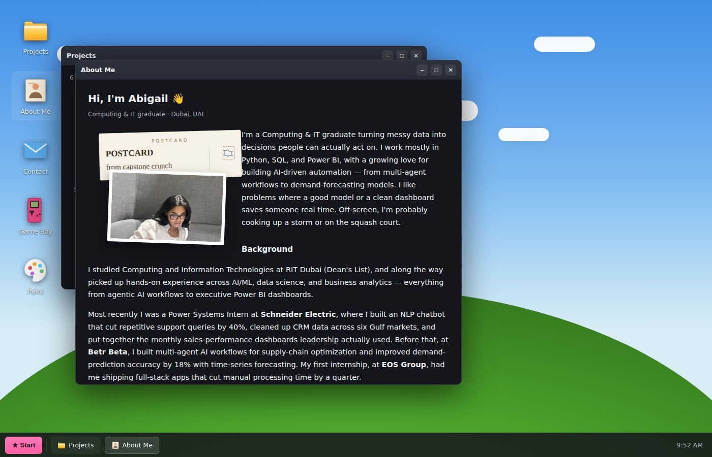
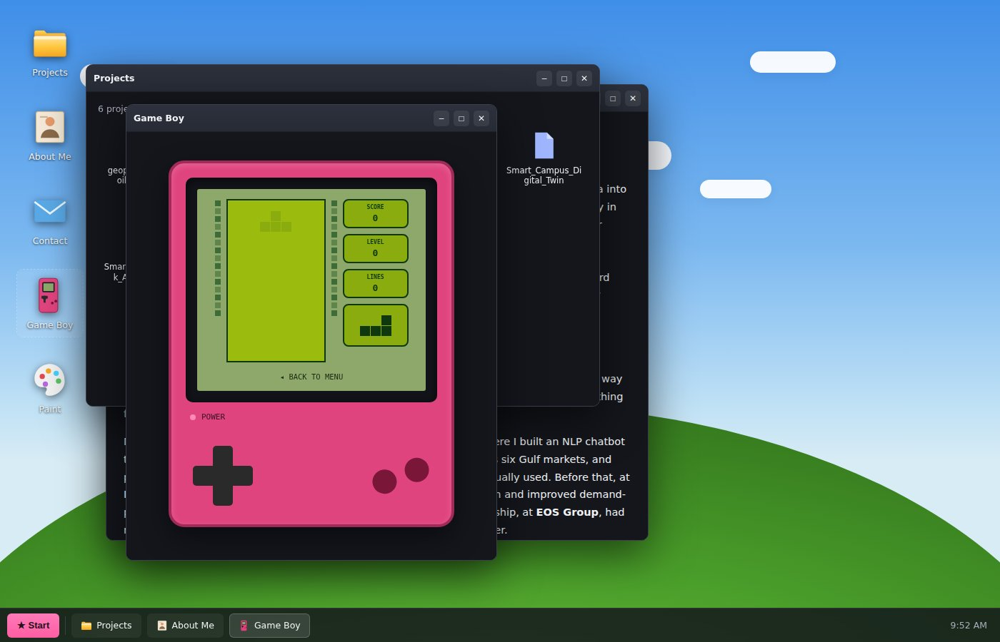
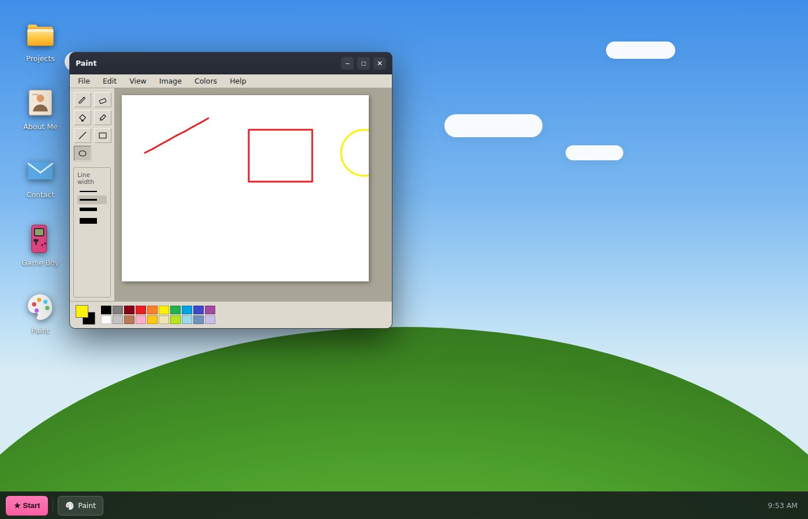

<div align="center">

# 🖥️ Abigail OS

### A portfolio that boots up.

A gamified personal portfolio built as a fully working desktop OS simulation in the
browser — draggable windows, a live GitHub-synced file explorer, a Game Boy Color with
three original mini-games, and a working Paint app. Inspired by
[daedalOS](https://github.com/DustinBrett/daedalOS).

[](./LICENSE)
[](https://react.dev)
[](https://vitejs.dev)
[](https://github.com/pmndrs/zustand)

[Live Demo](https://abigaildacosta.vercel.app) · [Report a Bug](https://github.com/abigail2327/portfolio-os/issues) · [Features](#-features)

</div>

---

## 📸 Preview

<table>
<tr>
<td width="50%"><p align="center"><sub>The desktop</sub></p></td>
<td width="50%"><p align="center"><sub>Live GitHub-synced projects</sub></p></td>
</tr>
<tr>
<td width="50%"><p align="center"><sub>About Me, postcard-style</sub></p></td>
<td width="50%"><p align="center"><sub>STAX running on the Game Boy</sub></p></td>
</tr>
</table>

<div align="center">

<p><sub>A working Paint app — pencil, fill, shapes, eyedropper</sub></p>
</div>

---

## ✨ Features

- 🪟 **Real window manager** — drag, resize, minimize, maximize, focus, and genuine multitasking with multiple windows open at once
- 📁 **Live File Explorer** — projects sync directly from the [GitHub API](https://github.com/abigail2327), no manual updates needed when a new repo goes up
- 📄 **README rendering** — opening a project renders its actual `README.md` as formatted markdown (sanitized with DOMPurify)
- 🙋 **About Me** — real bio, background, and a postcard-style travel photo gallery
- 🎮 **Game Boy Color** — a skinned handheld device hosting three original mini-games:
  - **STAX** — a block-stacking puzzle
  - **Ember & Tide** — a two-character elemental platformer (fire + water, played simultaneously)
  - **Barrel Bound** — a ladder-climbing, barrel-dodging platformer with sloped platforms
- 🎨 **Paint** — a real drawing app with pencil, eraser, fill bucket, eyedropper, line/rectangle/ellipse tools, and PNG export
- ⚙️ **Settings** — wallpaper picker (including a pixel-art Dubai skyline), audio toggle, one-click reset
- 💾 **Persistent, per-visitor state** — window layout, wallpaper, and icon positions are saved in your own browser via `localStorage`, and never affect what other visitors see
- ⌨️ **Keyboard shortcuts** — Alt+Tab window cycling, Escape to close
- 📱 **Full touch support** — drag, tap-to-open, and long-press context menus on mobile
- 🔊 **Original chiptune sound** — synthesized in real time via the Web Audio API, no sampled audio
- 🖥️ **Terminal easter egg** — try `whoami`, `projects`, or `sudo make me a sandwich`

## 🛠️ Tech Stack

| Layer | Tool |
|---|---|
| UI | React + Vite |
| State | Zustand (with `persist` middleware) |
| Animation | Framer Motion |
| Markdown | `marked` + `DOMPurify` |
| Audio | Web Audio API (synthesized, no sample files) |
| Data | GitHub REST API (live, unauthenticated, with static fallback) |

## 🚀 Getting Started

```bash
git clone https://github.com/abigail2327/portfolio-os.git
cd portfolio-os
npm install
npm run dev
```

Build for production:

```bash
npm run build
```

Outputs a static site to `dist/` — deployable to Vercel, Netlify, or any static host.

## 🔒 Security

- All rendered README markdown is sanitized with DOMPurify before injection — no raw HTML/script execution from repo content
- Security headers (CSP, X-Frame-Options, X-Content-Type-Options, Referrer-Policy, Permissions-Policy) via [`vercel.json`](./vercel.json)
- No secrets or API keys anywhere in the codebase — all GitHub API calls are unauthenticated public reads with a static-data fallback
- `npm audit` reports zero known vulnerabilities

## 🙏 Credits

- Concept and window-manager architecture inspired by [daedalOS](https://github.com/DustinBrett/daedalOS) by Dustin Brett (MIT licensed)
- Everything else — code, games, art, and copy — is original

## 📄 License

The source code in this repository is licensed under the [MIT License](./LICENSE).
Personal content (photos, resume/bio text, likeness) is **not** covered and remains all rights reserved.

---

<div align="center">
<sub>Built by <a href="https://github.com/abigail2327">Abigail Da Costa</a></sub>
</div>
